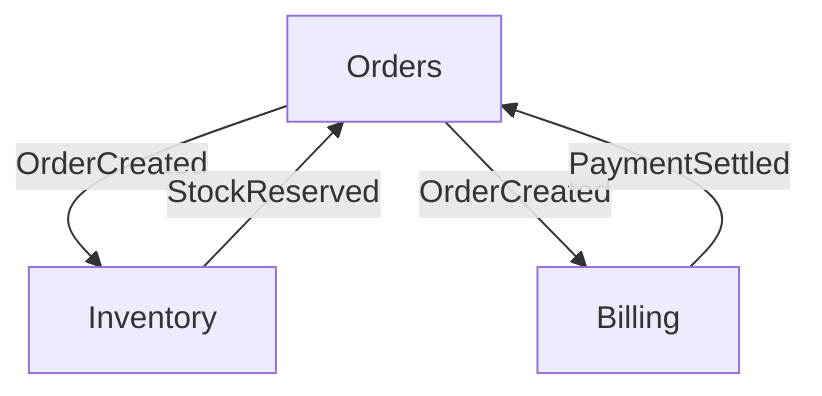
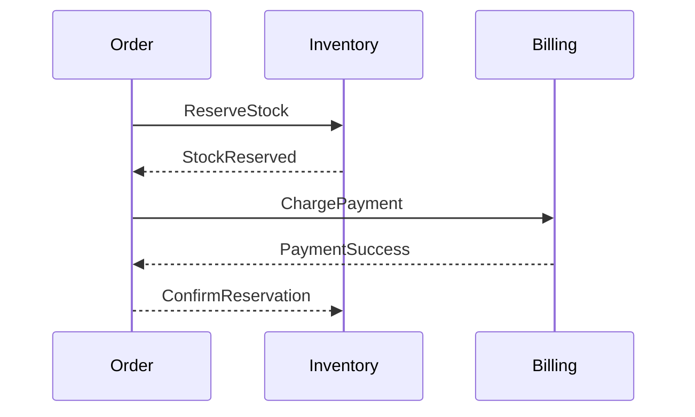

# Microservices Interview Guide

---

## 1. Microservices Fundamentals & Service Boundaries

### Concept Brief

Microservices decompose a system into independently deployable services aligned with bounded contexts. Each service owns its data and exposes well-defined interfaces.

### Why It Matters

- **Agility**: Bhopal teams release independently without monolith bottlenecks.
- **Resilience**: Failure in one service doesn’t topple the entire platform.
- **Scalability**: Scale hotspots (e.g., payments) without touching others.

### Practical Walkthrough

1. Identify domain capabilities (Orders, Inventory, Billing).
2. Map bounded contexts using Event Storming or Domain Storytelling.
3. Define service contracts (REST/gRPC/event schemas).
4. Assign independent data stores to avoid tight coupling.



### Follow-Up Questions

- How do you decide between coarse vs fine-grained services?
- What signals indicate a service boundary should be split or merged?
- How do you avoid shared database anti-patterns?

---

## 2. Monolith to Microservices Migration

### Concept Brief

Strangling a monolith involves incrementally peeling off capabilities into services while maintaining functionality. Techniques include the strangler fig pattern, proxying, and anti-corruption layers.

### Why It Matters

- **Risk Reduction**: Gradual migration avoids big-bang rewrites.
- **Continuity**: Bhopal customers experience zero downtime during transformation.
- **Maintainability**: Legacy modules gain clear interfaces for modernization.

### Practical Walkthrough

1. Identify candidate module (e.g., loyalty points).
2. Wrap legacy calls behind a facade.
3. Build new microservice; route specific traffic via API gateway.
4. Decommission legacy code once parity and stability achieved.

```text
Client -> Gateway -> (LoyaltyService | LegacyMonolith)
```

### Follow-Up Questions

- How do you handle shared authentication/session state during migration?
- What metrics determine readiness to cut over traffic?
- How do you rollback if the new microservice misbehaves?

---

## 3. Domain-Driven Design & Bounded Contexts

### Concept Brief

DDD aligns microservices with business domains, emphasizing ubiquitous language, aggregates, and context maps. Bounded contexts prevent model drift.

### Why It Matters

- **Alignment**: Bhopal stakeholders speak the same language as engineers.
- **Integrity**: Aggregates enforce invariants within boundaries.
- **Interoperability**: Context maps clarify integration relationships.

### Practical Walkthrough


```java
public class LoyaltyAggregate {
    private final LoyaltyId id;
    private int points;

    public void earn(int value) {
        points += value;
        DomainEvents.raise(new PointsEarnedEvent(id, value));
    }
}
```

### Follow-Up Questions

- How do you enforce aggregate boundaries to avoid distributed transactions?
- What is the difference between shared kernel, customer-supplier, conformist in context mapping?
- How do you evolve ubiquitous language as domains change?

---

## 4. API Gateway, Config Server, & Service Registry

### Concept Brief

- **Gateway**: Central ingress (e.g., Spring Cloud Gateway, Kong) that routes, secures, and shapes traffic.
- **Service Registry**: Tracks live instances (Eureka, Consul) to enable discovery and health awareness.
- **Config Server**: Centralized configuration source (Spring Cloud Config, Vault) that keeps environment data consistent.

### Why It Matters

- **Routing Control**: Canary deployments and path-based routing for Bhopal tenants.
- **Operational Insight**: Registry health data feeds scaling decisions.
- **Config Discipline**: Git-backed configuration keeps environments Drift-free.

### Practical Walkthrough

```yaml
spring:
  cloud:
    gateway:
      routes:
        - id: bhopal-orders
          uri: lb://BHOPAL-ORDER-SERVICE
          predicates:
            - Path=/bhopal/orders/**
          filters:
            - StripPrefix=1
            - name: RequestRateLimiter
              args:
                key-resolver: "#{@tenantKeyResolver}"
                replenishRate: 100
                burstCapacity: 200
```

```java
@Configuration
public class ServiceDiscoveryConfig {

    @Bean
    @Profile("bhopal")
    public DiscoveryClientOptionalArgs discoveryClientOptionalArgs() {
        DiscoveryClientOptionalArgs args = new DiscoveryClientOptionalArgs();
        args.setHealthCheckHandler(new BhopalHealthCheckHandler());
        return args;
    }
}
```

### Follow-Up Questions

- How do you roll gateway route updates safely across regions?
- Which failure modes occur if the service registry becomes unavailable?
- How do you encrypt sensitive properties in Config Server?

---

## 5. Circuit Breakers, Retries, & Fallbacks (Resilience4j)

### Concept Brief

Circuit breakers prevent cascading failures by halting calls to unstable services. Resilience4j brings pluggable policies: timeouts, retries, rate limiters, and bulkheads.

### Why It Matters

- **Stability**: No cascading Bhopal payment failures due to one downstream hiccup.
- **Graceful Degradation**: Serve cached quotes or manual override flows.
- **Observability**: Track breaker states to tune thresholds.

### Practical Walkthrough

```java
@Service
public class PaymentGatewayClient {

    private final CircuitBreaker circuitBreaker;
    private final Retry retry;
    private final PaymentFeignClient client;
    private final Cache<String, PaymentQuote> quoteCache;

    public PaymentGatewayClient(CircuitBreakerRegistry breakerRegistry,
                                RetryRegistry retryRegistry,
                                PaymentFeignClient client,
                                Cache<String, PaymentQuote> quoteCache) {
        this.circuitBreaker = breakerRegistry.circuitBreaker("bhopal-payment");
        this.retry = retryRegistry.retry("bhopal-payment");
        this.client = client;
        this.quoteCache = quoteCache;
    }

    public PaymentQuote fetchQuote(String orderId) {
        Supplier<PaymentQuote> decorated = CircuitBreaker.decorateSupplier(
            circuitBreaker,
            Retry.decorateSupplier(retry, () -> client.getQuote(orderId))
        );
        return Try.ofSupplier(decorated)
            .recover(CallNotPermittedException.class,
                ex -> quoteCache.getIfPresent(orderId))
            .recover(TimeoutException.class,
                ex -> PaymentQuote.fallback(orderId))
            .get();
    }
}
```

### Follow-Up Questions

- Which metrics influence your breaker thresholds (error rate, slow call rate)?
- How do you integrate circuit breaker state with alerting dashboards?
- When do you choose bulkheads vs. semaphores to isolate workloads?

---

## 6. Inter-Service Communication (REST, Messaging, gRPC)

### Concept Brief

Microservices communicate synchronously (REST, Feign) or asynchronously (Kafka). gRPC suits low-latency, strongly-typed interactions.

### Why It Matters

- **Performance**: gRPC binary protocol for real-time Bhopal tracking.
- **Developer Productivity**: Feign auto-generates REST clients with resilience policies.
- **Contract Clarity**: Shared protobuf/JSON schemas enforce compatibility.

### Practical Walkthrough

```java
@FeignClient(name = "bhopal-order-service", configuration = OrderClientConfig.class)
public interface OrderClient {
    @GetMapping("/internal/orders/{id}")
    OrderDetails fetchOrder(@PathVariable String id);
}
```

```proto
syntax = "proto3";
package tracking;

service ShipmentTracker {
  rpc Track(TrackRequest) returns (TrackResponse);
}
```

```java
@GrpcService
public class ShipmentTrackerImpl extends ShipmentTrackerGrpc.ShipmentTrackerImplBase {
    @Override
    public void track(TrackRequest request, StreamObserver<TrackResponse> responseObserver) {
        // implementation
    }
}
```

### Follow-Up Questions

- How do you version shared DTOs or protobuf contracts to avoid breaking consumers?
- When do you switch a REST call to messaging for better resilience?
- How do you enforce deadlines/timeouts across RPC boundaries?

---

## 7. Centralized Logging (ELK, Loki) & Observability

### Concept Brief

Aggregated logging pipelines capture structured logs from every service and surface them in Kibana or Grafana Loki for analysis and incident response.

### Why It Matters

- **Traceability**: Single query surfaces a Bhopal order’s journey across services.
- **Security**: Anomaly detection (login spikes, fraud).
- **Retention Control**: Tier logs by region to manage costs.

### Practical Walkthrough

```yaml
logging:
  pattern:
    console: "%d{ISO8601} %-5level [%X{correlationId}] %logger - %msg%n"

spring:
  sleuth:
    sampler:
      probability: 0.2
```

```json
{
  "timestamp": "2025-11-08T12:32:11.123Z",
  "level": "INFO",
  "service": "bhopal-inventory",
  "tenant": "bhopal",
  "correlationId": "f1c3-90b7",
  "message": "Reserved 10 units for order ORD-982"
}
```

### Follow-Up Questions

- How do you sample logs to balance cost and insight?
- Which fields are mandatory in every log event for forensic analysis?
- How do you correlate logs with metrics and traces?

---

## 8. Distributed Tracing (Sleuth, Zipkin, OpenTelemetry)

### Concept Brief

Tracing instruments requests end-to-end, capturing spans across services. Sleuth auto-tags spans; Zipkin/Jaeger visualize them; OpenTelemetry standardizes instrumentation.

### Why It Matters

- **Latency Analysis**: Identify slow hops in Bhopal order pipelines.
- **Root Cause Analysis**: Spot where errors originate in multi-hop flows.
- **Capacity Planning**: Understand usage patterns per endpoint.

### Practical Walkthrough

```java
@RestController
public class CheckoutController {

    private final Tracer tracer;
    private final PaymentGatewayClient paymentGatewayClient;

    public CheckoutController(Tracer tracer, PaymentGatewayClient paymentGatewayClient) {
        this.tracer = tracer;
        this.paymentGatewayClient = paymentGatewayClient;
    }

    @PostMapping("/checkout")
    public ResponseEntity<OrderConfirmation> checkout(@RequestBody CheckoutRequest request) {
        Span span = tracer.nextSpan().name("bhopal-checkout").start();
        try (Tracer.SpanInScope ws = tracer.withSpan(span)) {
            span.tag("tenant", "bhopal");
            span.event("validate-cart");
            // business logic
            return ResponseEntity.ok(confirm);
        } finally {
            span.end();
        }
    }
}
```

### Follow-Up Questions

- How do you propagate trace context through Kafka or async executors?
- What sampling strategies keep tracing affordable but informative?
- How do you integrate traces with Service Level Objectives (SLOs)?

---

## 9. Config Management & Environment Isolation

### Concept Brief

Configuration strategies ensure each environment (dev, QA, Bhopal prod) uses consistent, auditable settings while keeping secrets secure.

### Why It Matters

- **Change Safety**: GitOps ensures every config change is reviewed.
- **Isolation**: Tenants/regions maintain dedicated resources without cross-contamination.
- **Compliance**: Auditable trail for regulatory requirements.

### Practical Walkthrough

```yaml
# config-repo/bhopal-order-service-bhopal.yaml
spring:
  datasource:
    url: jdbc:postgresql://bhopal-db.internal:5432/orders
    username: ${ORDERS_DB_USER}
    password: ${ORDERS_DB_PASS}
bhopal:
  region: bhopal
  feature-flags:
    enable-smart-routing: true
```

```bash
kubectl create secret generic bhopal-order-secrets \
  --from-literal=ORDERS_DB_USER=bhopal_user \
  --from-literal=ORDERS_DB_PASS=super-secret
```

### Follow-Up Questions

- How do you detect config drift across clusters?
- What approval workflow handles emergency config changes?
- How do you roll back configuration safely?

---

## 10. API Versioning & Backward Compatibility

### Concept Brief

Versioning strategies (`/v1`, media types, header-based) protect consumers during evolving API schemas. Feature flags and adapter patterns smooth migrations.

### Why It Matters

- **Client Trust**: Consumers (mobile apps, partner integrations) upgrade on their terms.
- **Operational Flexibility**: Run A/B tests with new features.
- **Risk Reduction**: Gradual rollouts reduce breaking change risk.

### Practical Walkthrough

```java
@RestController
public class OrderControllerV1 {
    @GetMapping(value = "/v1/orders/{id}", produces = "application/vnd.bhopal.order.v1+json")
    public OrderResponseV1 getOrder(@PathVariable String id) { /* ... */ }
}

@RestController
public class OrderControllerV2 {
    @GetMapping(value = "/v2/orders/{id}", produces = "application/vnd.bhopal.order.v2+json")
    public OrderResponseV2 getOrder(@PathVariable String id) { /* ... */ }
}
```

```java
public class OrderAdapter {
    public OrderResponseV1 adapt(OrderResponseV2 v2) {
        return OrderResponseV1.builder()
            .orderId(v2.orderId())
            .status(v2.status().toString())
            .total(v2.pricing().total())
            .build();
    }
}
```

### Follow-Up Questions

- How long do you retain legacy versions, and how do you communicate deprecation?
- When do you choose consumer-driven contracts (CDC) to guard compatibility?
- How do you automate schema validation across versions?

---

## 11. Fault Tolerance, Scalability, & Load Balancing

### Concept Brief

Microservices must survive failures and scale elastically. Techniques include auto-scaling policies, hot-standby redundancy, and smart load balancing.

### Why It Matters

- **Reliability**: Bhopal shoppers expect consistent uptime during festivals.
- **Cost Efficiency**: Scale in when load dips to save infrastructure spend.
- **Chaos Readiness**: Regular drills ensure recovery plans work.

### Practical Walkthrough

```yaml
apiVersion: autoscaling/v2
kind: HorizontalPodAutoscaler
metadata:
  name: bhopal-inventory-hpa
spec:
  scaleTargetRef:
    apiVersion: apps/v1
    kind: Deployment
    name: bhopal-inventory
  minReplicas: 3
  maxReplicas: 15
  metrics:
    - type: Resource
      resource:
        name: cpu
        target:
          type: Utilization
          averageUtilization: 60
    - type: Pods
      pods:
        metric:
          name: kafka_consumer_lag
        target:
          type: AverageValue
          averageValue: 100
```

```bash
# Chaos experiment: terminate pod randomly
kubectl delete pod -l app=bhopal-inventory --wait=false
```

### Follow-Up Questions

- What chaos experiments validate your failover strategy?
- How do you load test cross-region failover scenarios?
- How do you balance traffic based on instance health (e.g., Envoy, Istio)?

---

## 12. Containerization & Deployment Pipelines

---

## 13. Data Management Patterns (Saga, CQRS, Event Sourcing)

### Concept Brief

Distributed data introduces consistency challenges. Saga coordinates multi-service transactions via orchestration or choreography. CQRS separates read/write models; event sourcing persists append-only events.

### Why It Matters

- **Consistency**: Reliable state changes across Bhopal services.
- **Auditability**: Event store tracks history for compliance.
- **Scalability**: Read models optimized for queries.

### Practical Walkthrough



```java
public class OrderSaga {
    private final SagaDefinition<OrderData> sagaDefinition =
        step()
            .invokeParticipant(o -> commands.reserveStock(o.orderId(), o.items()))
            .onReply(StockReserved.class, OrderData::setStockReserved)
            .withCompensation(o -> commands.releaseStock(o.orderId()))
        .step()
            .invokeParticipant(o -> billing.charge(o.orderId(), o.totalAmount()))
            .onReply(PaymentProcessed.class, OrderData::setPaymentSuccess)
        .build();
}
```

### Follow-Up Questions

- When do you choose orchestration vs choreography sagas?
- How do you rebuild read models in CQRS after schema changes?
- What are the trade-offs of event sourcing (storage, replay, GDPR)?

---

## 14. Service Mesh & API Governance

### Concept Brief

Service meshes (Istio, Linkerd) inject sidecars to handle service-to-service communication, TLS, retries, and observability. API governance ensures consistent policies and documentation.

### Why It Matters

- **Security**: Mutual TLS between Bhopal services without code changes.
- **Traffic Control**: Canary releases, A/B testing via virtual services.
- **Compliance**: Enforce rate limits and schemas centrally.

### Practical Walkthrough

```yaml
apiVersion: networking.istio.io/v1beta1
kind: VirtualService
metadata:
  name: bhopal-orders
spec:
  hosts:
    - bhopal-orders
  http:
    - route:
        - destination:
            host: bhopal-orders
            subset: v2
          weight: 20
        - destination:
            host: bhopal-orders
            subset: v1
          weight: 80
```

### Follow-Up Questions

- How do you decide between ingress gateway vs service mesh features?
- What governance practices keep APIs documented and discoverable?
- How do you monitor and debug sidecar overhead?

---

## 15. Security & Zero Trust Architecture

### Concept Brief

Microservices adopt defense-in-depth: mutual TLS, API authentication, authorization, secret management, and audit trails. Zero trust treats every call as hostile until proven otherwise.

### Why It Matters

- **Compliance**: Meets regional regulations for Bhopal data.
- **Risk Reduction**: Limits blast radius of compromised service.
- **Auditability**: Detailed access logs for investigations.

### Practical Walkthrough

1. Issue short-lived certificates via SPIFFE/SPIRE.
2. Use service mesh for mTLS enforcement.
3. Externalize authorization with OPA/ABAC policies.
4. Rotate secrets via Vault or AWS Secrets Manager.

```rego
package bhopal.authz

allow {
  input.request.method == "POST"
  input.request.path == ["bhopal", "orders"]
  input.jwt.claims.role == "ORDER_WRITER"
}
```

### Follow-Up Questions

- How do you secure inter-service communication across clusters?
- What strategies manage secrets in CI/CD pipelines?
- How do you implement attribute-based access control (ABAC)?

---

## 16. Testing Strategies (Contract, Component, End-to-End)

### Concept Brief

Microservice testing combines unit, component, contract, integration, and chaos testing. Consumer-driven contracts (CDC) ensure compatibility between services.

### Why It Matters

- **Confidence**: Catch integration issues before production.
- **Velocity**: Parallel pipelines per service.
- **Reliability**: Chaos engineering validates failure handling.

### Practical Walkthrough

```groovy
// Pact consumer test
given("Order exists")
  .uponReceiving("retrieve order")
  .path("/orders/ORD-123")
  .method("GET")
  .willRespondWith()
  .status(200)
  .body(newJsonObject { ... })
```

```bash
litmusctl create chaos-engine --file bhopal-network-latency.yaml
```

### Follow-Up Questions

- How do you automate contract verification in CI?
- When do you run full E2E tests vs service-level tests?
- How do you monitor and control chaos experiments?

---

## 17. Observability & SLO Management

### Concept Brief

Service Level Objectives (SLOs) define acceptable performance/error budgets. Observability integrates metrics, logs, traces, and alerting to manage SLOs.

### Why It Matters

- **Accountability**: Teams maintain Bhopal SLAs confidently.
- **Prioritization**: Error budgets guide feature vs reliability work.
- **Response**: Accurate alerts reduce mean time to recovery (MTTR).

### Practical Walkthrough

```yaml
apiVersion: monitoring.coreos.com/v1
kind: PrometheusRule
metadata:
  name: bhopal-slo
spec:
  groups:
    - name: availability
      rules:
        - record: bhopal_order_service:sli_availability
          expr:
            sum(rate(http_server_requests_seconds_count{status=~"2.."}[5m])) /
            sum(rate(http_server_requests_seconds_count[5m]))
        - alert: BhopalOrderSLOBurn
          expr: (1 - bhopal_order_service:sli_availability) > 0.02
          for: 5m
```

### Follow-Up Questions

- How do you define error budgets and link them to deployment policies?
- What dashboards help diagnose multi-service incidents quickly?
- How do you ensure tracing spans cover business-critical journeys?

---

### Quick References

- **Service design**: Align with bounded contexts, avoid shared DBs.
- **Migration**: Strangler fig, anti-corruption layers, gradual cutover.
- **Resilience**: Circuit breakers, retries, bulkheads, sagas, chaos drills.
- **Communication**: REST, events, gRPC; enforce contracts via schemas.
- **Data**: Event sourcing, CQRS, saga orchestration, schema evolution.
- **Security**: Mutual TLS, API gateways, OPA policies, secret rotation.
- **Observability**: Logs + metrics + traces + SLOs; integrate with alerting.
- **Deployment**: Immutable images, GitOps, progressive delivery, canaries.
- **Testing**: Unit, contract, integration, chaos, performance, smoke.
- **Governance**: API documentation, versioning strategy, reliability reviews.

This concludes the expanded microservices interview pack tuned for Bhopal platforms.\*\*\*

### Concept Brief

Containerization packages microservices with dependencies into lightweight runtimes. Build pipelines (Docker, Jib) and scanning (Trivy) ensure supply chain security.

### Why It Matters

- **Consistency**: Identical behavior from dev laptops to Bhopal production.
- **Speed**: Fast, incremental deployments via CI/CD.
- **Security**: Vulnerability scanning integrated into build steps.

### Practical Walkthrough

```dockerfile
FROM eclipse-temurin:17-jre-alpine
ARG JAR_FILE=target/bhopal-pricing.jar
COPY ${JAR_FILE} app.jar
ENTRYPOINT ["java","-XX:MaxRAMPercentage=75.0","-jar","/app.jar"]
```

```bash
mvn -Pbhopal jib:build \
  -Dimage=registry.local/bhopal-pricing:$(git rev-parse --short HEAD)

trivy image --severity HIGH,CRITICAL registry.local/bhopal-pricing:latest
```

### Follow-Up Questions

- How do you control container sprawl and tag hygiene across environments?
- What multi-stage Docker optimizations cut image size?
- How do you bake SBOM (Software Bill of Materials) into images?

---

### Quick References

- **Gateway playbook**: Canary routing, circuit breaker filters, rate limiter tuning.
- **Resilience KPIs**: Error rate, slow call duration, retries, fallback hits.
- **Communication choices**: REST for CRUD, gRPC for low-latency, messaging for eventual consistency.
- **Observability trio**: Logs + metrics + traces with shared correlation IDs.
- **Config hygiene**: GitOps, secrets rotation, drift detection.
- **Versioning policy**: Sunset calendar, contract testing, schema registries.
- **Resilience drills**: Chaos experiments, load shedding, blue/green deployments.
- **Container best practices**: Read-only filesystem, non-root users, minimal base images.

This concludes the microservices interview pack tuned for Bhopal platforms.\*\*\*
